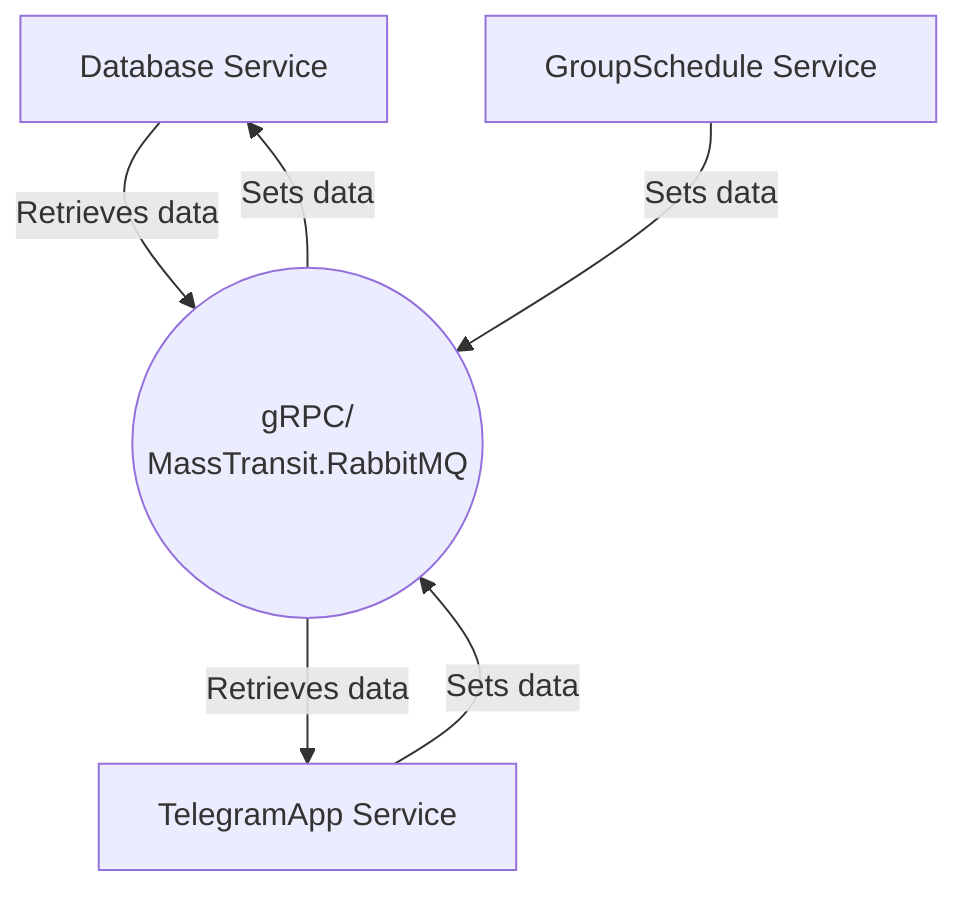

# LOR
LOR - application for organizing queues for students laboratory work

<p align="center">
	
</p>

## Architecture




## Installation and Running
1. **Clone the repository:**
   ```bash
   git clone https://github.com/TheActualTwinkle/LOR.git
   ```
2. **Fill the '???' gaps in _.env_ file. Other settings may be left as is**
	```env
	TELEGRAM_BOT_TOKEN=???
	
	DATABASE_COMMUNICATION_URL=http://databaseapp:31401
	POSTGRES_DB=lor
	POSTGRES_USER=postgres
	POSTGRES_PASSWORD=123456789
	
	RABBITMQ_HOST=rabbitmq
	RABBITMQ_USER=guest
	RABBITMQ_PASSWORD=guest
	```
3. **Build and run Docker containers:**
    ```bash
    git cd LOR
    docker-compose up --build
    ```

## Technology Stack

- ASP.NET
- Docker
- gRPC
- MassTransit.RabbitMQ
- Entity Framework
- PostgreSQL
- Mapster
- Redis
- NUnit

## Contribution and Feedback

Bugs and improvements must be submitted through [issues](https://github.com/TheActualTwinkle/LOR/issues) and [pull requests](https://github.com/TheActualTwinkle/LOR/pulls)

## Special thanks
- [Nikitka](https://github.com/shishnk) for the inspiration and mentorship
- [NSTU](https://nstu.ru) for the original purpose

## License

The project is licensed under the MIT license. For more information, see the [LICENSE](https://github.com/TheActualTwinkle/LOR/blob/main/LICENSE).