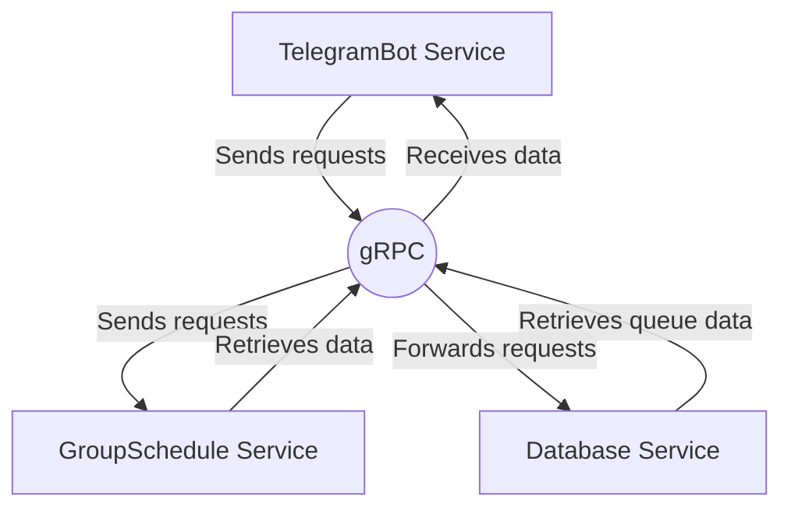

# LOR
ЛабОчередь - приложение для организации очередей на лабораторные работы для студентов

## Architecture

```mermaid
flowchart TD;
    A[TelegramBot Service] -->|Sends requests| B((gRPC));
    B -->|Sends requests| D[GroupSсhedule Service];
    D -->|Retrieves data| B;
    B -->|Forwards requests| C[Database Service];
    C -->|Retrieves queue data| B;
    B --> |Receives data| A
```

